# AWS VPC Network Architecture with EC2 Web Server

## 📌 Project Overview

This project demonstrates how to build a secure and scalable Virtual Private Cloud (VPC) in Amazon Web Services (AWS) and deploy a web server inside a public subnet.

The objective of this project is to understand AWS networking fundamentals including VPCs, Subnets, Internet Gateway, Route Tables, Security Groups, and EC2.

---

## 🚀 AWS Services Used

- Amazon VPC
- Public Subnet
- Private Subnet
- Internet Gateway (IGW)
- Route Tables
- Security Groups
- Amazon EC2
- Amazon Linux 2023

---

# Project Architecture

```
                    Internet
                        │
                        ▼
               Internet Gateway
                        │
                        ▼
                 AWS VPC (10.0.0.0/16)
                ┌─────────────────────┐
                │                     │
                │ Public Subnet       │
                │ 10.0.1.0/24         │
                │                     │
                │  EC2 Web Server     │
                │                     │
                └─────────────────────┘
                        │
                Route Table (0.0.0.0/0)
                        │
                Internet Gateway

                ┌─────────────────────┐
                │ Private Subnet      │
                │ 10.0.2.0/24         │
                └─────────────────────┘
```

---

# Network Configuration

| Resource | Configuration |
|----------|---------------|
| VPC | 10.0.0.0/16 |
| Public Subnet | 10.0.1.0/24 |
| Private Subnet | 10.0.2.0/24 |
| Internet Gateway | Attached |
| Route Table | Public Route |
| EC2 Instance | Amazon Linux 2023 |
| Instance Type | t2.micro |
| Security Group | SSH + HTTP |

---

# Security Group Rules

## Inbound

| Type | Port | Source |
|------|------|--------|
| SSH | 22 | My IP |
| HTTP | 80 | Anywhere |

## Outbound

Allow All Traffic

---

# Implementation Steps

## Step 1

Created a custom VPC.

---

## Step 2

Created:

- Public Subnet
- Private Subnet

---

## Step 3

Created and attached an Internet Gateway.

---

## Step 4

Created a Public Route Table.

---

## Step 5

Added Route

```
Destination:
0.0.0.0/0

Target:
Internet Gateway
```

---

## Step 6

Associated the Public Subnet with the Public Route Table.

---

## Step 7

Enabled Auto Assign Public IPv4 Address.

---

## Step 8

Created a Security Group.

Allowed:

- SSH (22)
- HTTP (80)

---

## Step 9

Launched an EC2 instance inside the Public Subnet.

---

## Step 10

Connected to the EC2 instance using SSH.

Installed Apache Web Server.

```bash
sudo yum update -y
sudo yum install httpd -y
sudo systemctl enable httpd
sudo systemctl start httpd
```

---

## Step 11

Created a sample webpage.

```html
<h1>🚀 AWS VPC Project</h1>
<p>Hosted on Amazon EC2</p>
<p>Created by Tanweer Ahmed</p>
```

---

## Project Screenshots

### VPC Created

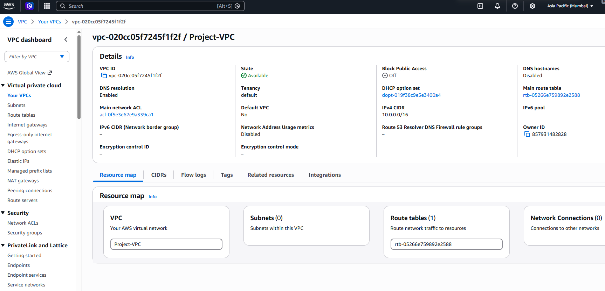

---

### Public Subnet

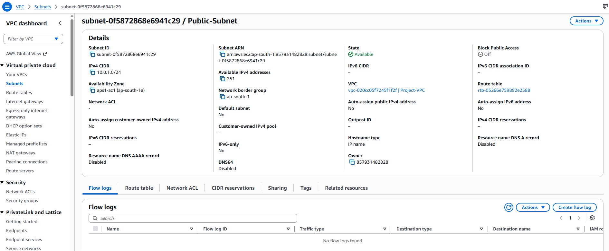

---

### Private Subnet

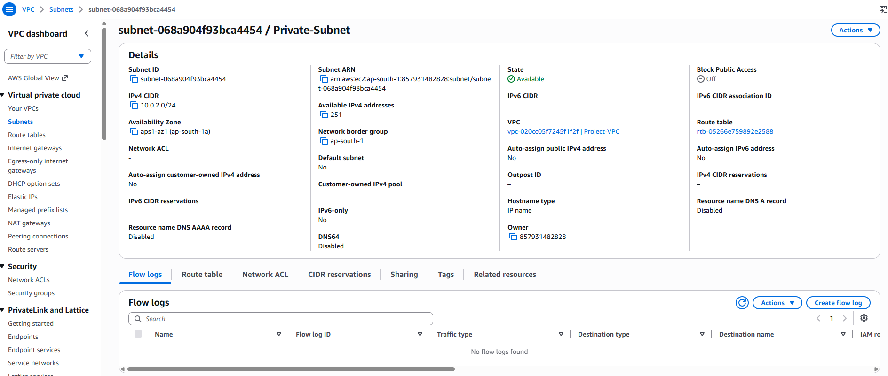

---

### Internet Gateway

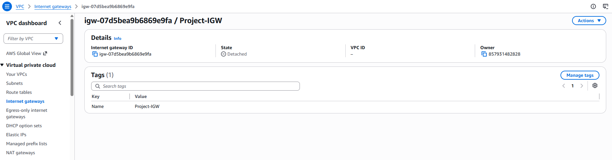

---

### IGW Attached

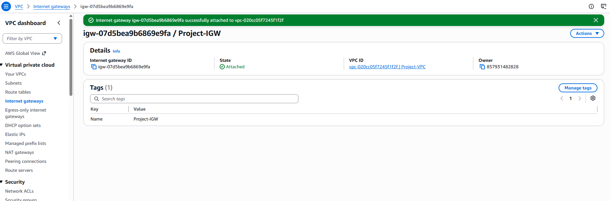

---

### Route Table

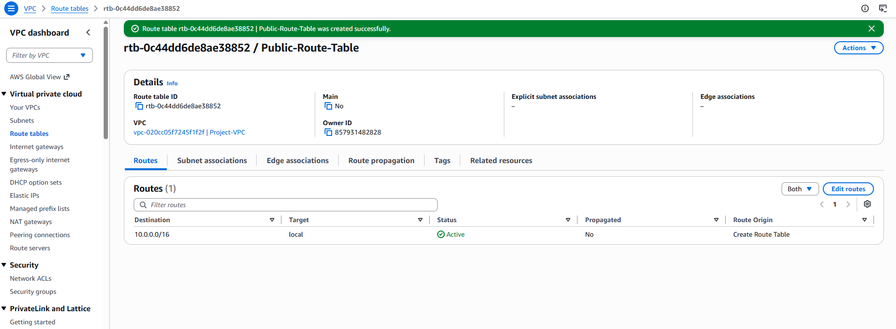

---

### Route Added

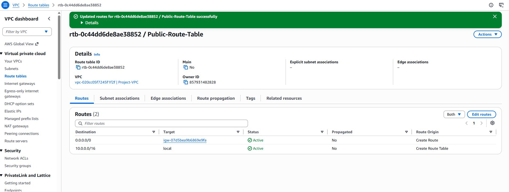

---

### Public Subnet Association

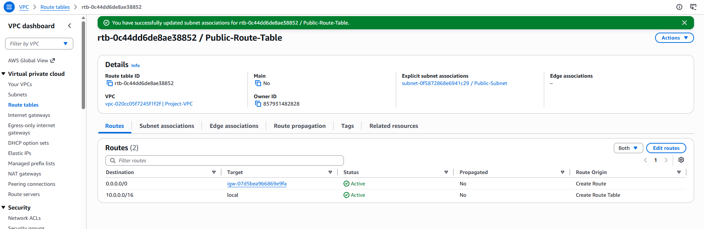

---

### Auto Public IP Enabled

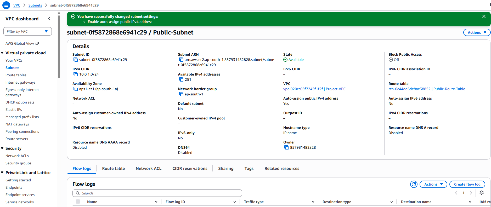

---

### Security Group

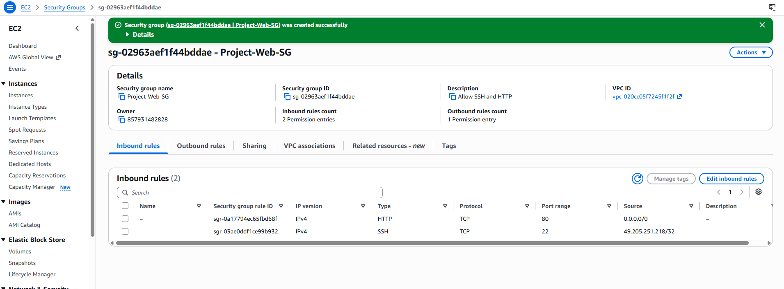

---

### EC2 Web Server

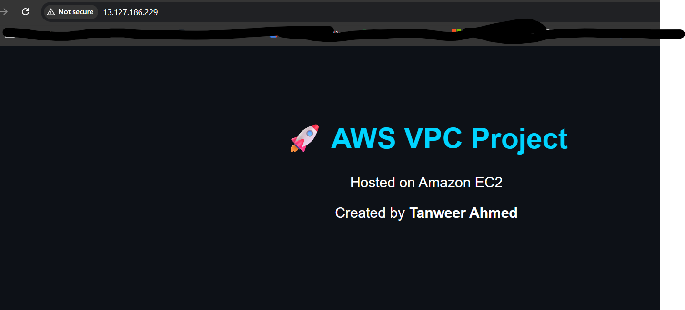

---

### EC2 Instance

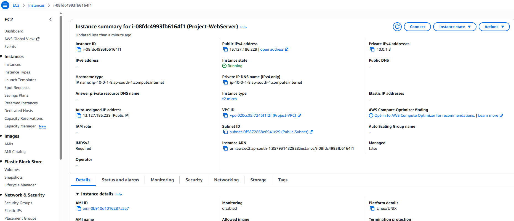

---

# Key Learnings

- AWS VPC fundamentals
- CIDR block planning
- Public vs Private Subnets
- Internet Gateway
- Route Tables
- Security Groups
- EC2 Deployment
- Linux Server Administration
- Apache Web Server Installation
- Networking Fundamentals

---

# Cleanup

After completing the project:

- Terminated EC2 Instance
- Deleted Security Group
- Deleted Route Tables
- Detached Internet Gateway
- Deleted Internet Gateway
- Deleted Subnets
- Deleted VPC

This avoids unnecessary AWS charges.

---

# Repository

GitHub Repository

https://github.com/shaiktanweer5/aws-vpc-network-architecture

---

# Connect With Me

**Portfolio**

https://tanweerahmed.in

**LinkedIn**

https://linkedin.com/in/shaik-tanweer-ahmed

**GitHub**

https://github.com/shaiktanweer5

---

## ⭐ If you found this project helpful, don't forget to Star this repository!
